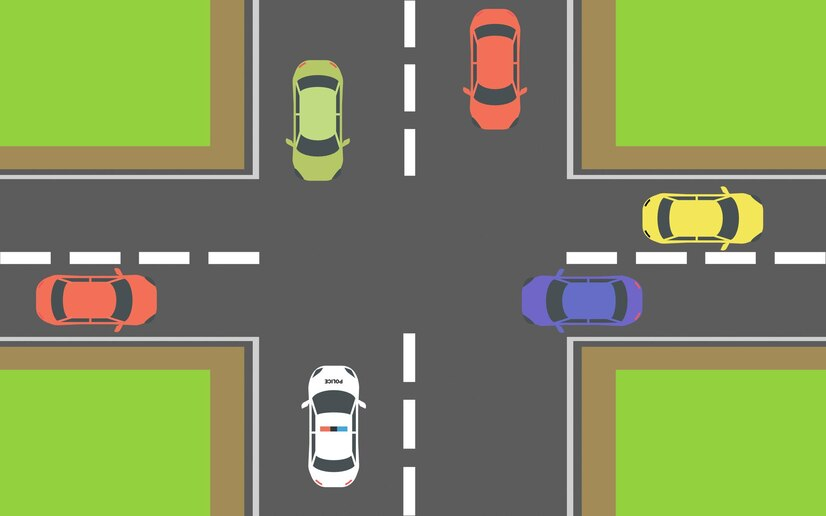

# Modelación de sistemas multiagentes con gráficas computacionales (TC2008B.102)

 <h3> Equipo 2 </h3> 

 <h3> Actividad M5. Revisión de avance 2 </h3> 

 <h3> Fecha de entrega: 1 de septiembre de 2023 </h3> 

 <h3> Profesores:  
- Edgar Covantes Osuna
- Raúl Valente Ramírez Velarde  
 </h3>

| Nombres | Apellidos | Matrícula |
|---------|-----------|-----------|
| Gustavo | Téllez Mireles | A01747114 |
| Eduardo Francisco | Lugo Quintana | A01747490 |
| Ramón Yuri | Danzos García | A00227838 |
| María Fernanda | Argueta Wolke | A00830194 |

## Sistema de multiagentes a utilizar

Se diseñará un sistema donde se simula la intersección de una calle. En la intersección se encuentran carros manejando en su carril designado según su destino. Cada dirección posee un semáforo que dirige el comportamiento de los carros. Su objetivo es actuar de forma inteligente para resolver la problemática del tráfico de la forma más eficiente posible. A continuación se presenta una imagen de ejemplo del tipo de intersección que se desea modelar.

- 

Para el modelo de la simulación se utilizará un MultiGrid donde cada auto utilizara una celda del modelo y pasarán por debajo del semáforo.
Para la activación de la simulación se utilizará SimultaneousActivation. Se generarán carros de manera aleatoria en cada calle de la intersección y avanzarán de manera simultánea en el step dependiendo de la luz del semáforo.

| Agentes Involucrados | Tipo de Agente | Interacciones |
|-----------------------|----------------|---------------|
| trafficModel         | Model          | - Interacción con la generación randomizada de carAgents
                                        - Interacción de lightAgent para su generación en posición fija
                                        - Establece el step para carAgent |
| carAgent             | Agent          | - Interacción con otros carAgents para evitar choques
                                        - Interacción con lightAgent para saber su comportamiento de movimiento en el siguiente paso. |
| lightAgent           | Agent          | - Interacción entre los lados del semáforo para saber el estado que le corresponde a cada uno en base al estado de luz de los otros.
                                        - Cada lado del semáforo se encarga de comunicarse con el grid para consultar la acumulación de carAgent en las coordenadas que le corresponden dependiendo de la ubicación del semáforo. |

## Plan de trabajo actualizado
- [Repositorio en GitHub](https://github.com/VMink/Multiagentes.git)
- [Backlog en GitHub](https://github.com/users/VMink/projects/1)
- 

## Aprendizaje adquirido

### Autonomía en el Aprendizaje
Todo el equipo logró aprender de manera autodidacta acerca del framework de Mesa y Python en general, con lo cual, junto con nuestra propia iniciativa, dependemos para lograr nuestras tareas.

### Entendimiento de Simulaciones
Hemos obtenido un entendimiento más profundo de las simulaciones en el framework de Mesa, las funciones que contiene la librería y cómo aplicarlo todo a diferentes escenarios y situaciones.

### Lógica antes de Comenzar a Programar
Durante el desarrollo del proyecto como equipo, se logró entender la importancia de tomar un tiempo antes de programar, con el fin de comprender en detalle el funcionamiento requerido y cuáles son las mejores alternativas para el diseño del proyecto.

### Colaboración
Debido a que la clase y los trabajos se llevaron a cabo mediante un entorno colaborativo, hemos perfeccionado nuestra comunicación en el equipo, además de establecer nuestras formas de comunicación para poder compartir ideas rápidamente entre nosotros. También hemos puesto en práctica el control de versiones y la asignación de tareas mediante nuestro ambiente en Github.

